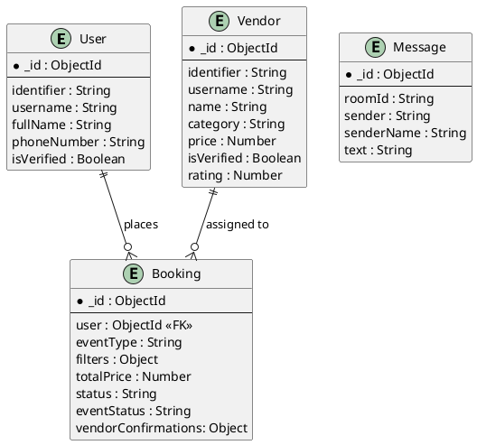
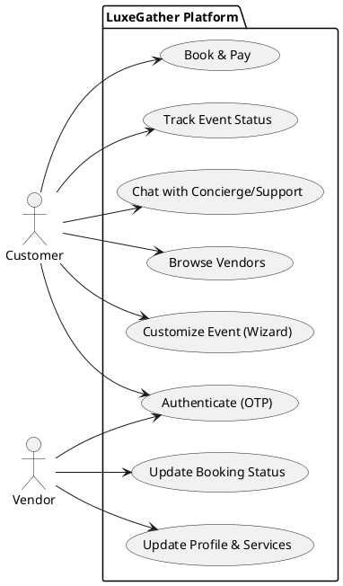
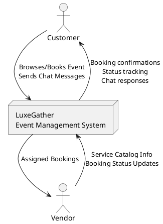
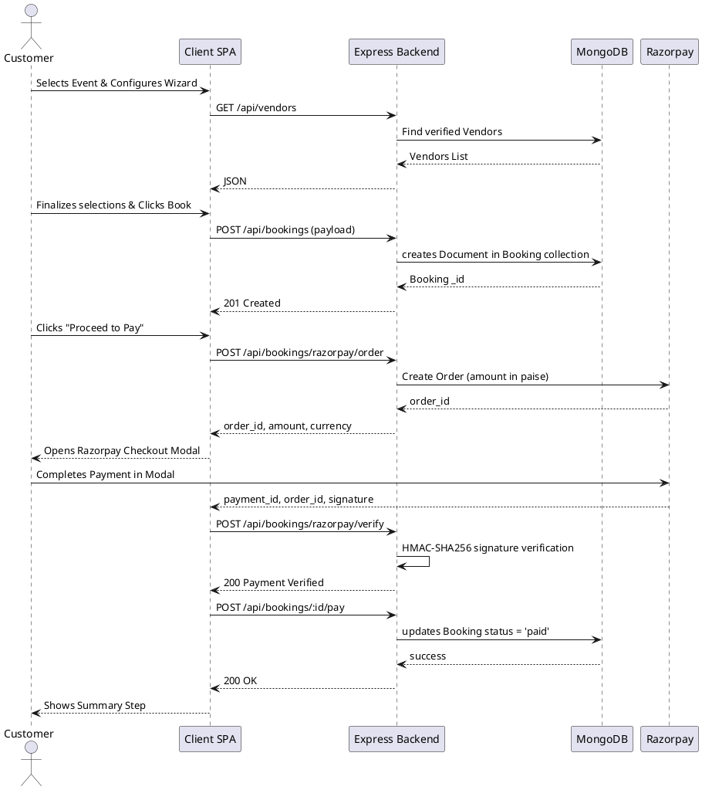

# LuxeGather Architecture Document

> **Last Updated:** May 2026 — Updated to reflect Razorpay payment integration, MongoDB Atlas migration, and cloud deployment via Railway (backend) and Netlify (frontend).

## 1. Project Understanding

Based on an analysis of the codebase, the following features have been identified:
- **Authentication System**: OTP-based login and registration for both customers and vendors. Profile completion steps to collect additional user data.
- **Service Browsing**: A landing page with vendor details grouped by categories (Venue, Catering, Decorations, Entertainment, Photography).
- **Event Customization Wizard**: A multi-step flow allowing customers to set filters (budget, guest count, dates, location) and individually select vendors for different event parameters.
- **Booking & Payment Functionality**: Consolidates selected vendors and computes a total price. Integrated with **Razorpay Payment Gateway** for real-money transactions in INR. The flow creates a server-side order, launches the Razorpay checkout modal, and verifies the payment signature on the backend before marking the booking as paid.
- **Dashboards**: 
  - **Customer Dashboard**: To view booking history and track the status of current events.
  - **Vendor Dashboard**: To track assigned bookings and update fulfillment status (Pending, Confirmed, Completed).
- **Real-Time Customer Support Chat**: A chat widget powered by Socket.IO, with a mock "concierge" automatic response logic.

---

## 2. Architecture Identification

**Type**: Monolithic Client-Server Architecture (with separate frontend and backend apps)

**Justification based on Code Structure**:
- **Single Express Server**: The `server/index.js` acts as the single entry point orchestrating all backend operations. There is no inter-service communication or separate internal microservices. All routes (`auth`, `vendors`, `bookings`) reside within the same Express instance.
- **Single Database Context**: All data models (`User`, `Vendor`, `Booking`, `Message`, `OtpVerification`) share a single MongoDB connection instance.
- **Client Application**: The `client` directory holds a monolithic React Single Page Application (SPA).

---

## 3. Tech Stack Detection

**Frontend**:
- **Framework**: React 18 (Vite Bundler).
- **Styling**: Vanilla CSS (`index.css`, component-specific CSS like `ChatWidget.css`).
- **HTTP Client**: Axios.
- **Real-time Client**: `socket.io-client`.
- **UI Utilities**: `lucide-react` (icons), `react-datepicker`, `date-fns`.

**Backend**:
- **Framework**: Node.js with Express 4.19.
- **Real-time Engine**: Socket.IO 4.8.
- **File Processing**: Multer + `multer-storage-cloudinary` (Image uploads mapped to Cloudinary).
- **Security/Parsing**: Cors, `dotenv` for env vars.

**Database**:
- **Type**: MongoDB Atlas (Cloud-hosted, Cluster0 on AWS)
- **ODM**: Mongoose 8.5.2.

**Payment Gateway**:
- **Provider**: Razorpay (Test Mode)
- **Server Package**: `razorpay` npm package (v2.9.6)
- **Client SDK**: Dynamically loaded `checkout.razorpay.com/v1/checkout.js`
- **Security**: HMAC-SHA256 signature verification using Node.js `crypto` module

**Authentication Model**:
- **Mechanism**: Custom OTP simulation (`1234`).
- **Session Management**: Handled purely via Client State (Storing `user` object in React State). **No JSON Web Tokens (JWT) or HTTP-Only Cookies are enforced in the API routes.**

---

## 4. Folder Structure Explanation

### `client/` (Frontend)
- **`src/`**: Main directory for application source code.
  - **`components/`**: Contains all reusable and page-level React components `AuthForms.jsx`, `LandingPage.jsx`, `Dashboard.jsx`, modal popups, and wizard steps.
  - **`App.jsx`**: The core state container and orchestrator. Manages routing through conditional rendering (`step` state).
  - **`utils/`**: Helper methods for the frontend.

### `server/` (Backend)
- **`models/`**: Houses Mongoose database schemas defining the data structure.
- **`routes/`**: Express Router endpoints logically separated into domains (`auth.js`, `bookings.js`, `vendorAuth.js`, `vendors.js`).
- **`middleware/`**: Custom Express middlewares (e.g., `upload` middleware using Multer for images).
- **`config/`**: Configuration configurations (e.g., Cloudinary API setups).
- **`index.js`**: Bootstraps the Express application, sets up CORS, connects to MongoDB, mounts routes, and initiates the Socket.IO server.

---

## 5. API Analysis

| Endpoint | Method | Purpose |
| :--- | :--- | :--- |
| `/api/auth/request-otp` | `POST` | Generates Mock OTP ('1234') for Customer. |
| `/api/auth/verify-otp` | `POST` | Verifies Customer OTP and authenticates. |
| `/api/auth/complete-profile` | `POST` | Updates unverified Customer details. |
| `/api/vendor/request-otp` | `POST` | Generates Mock OTP ('1234') for Vendor. |
| `/api/vendor/verify-otp` | `POST` | Verifies Vendor OTP and authenticates. |
| `/api/vendor/complete-profile`| `POST` | Sets vendor business name, category, pricing, etc. |
| `/api/vendors/` | `GET` | Retrieves all verified vendors grouped by category. |
| `/api/vendors/:id/profile` | `PUT` | Updates an individual vendor profile (accepts image). |
| `/api/bookings/` | `POST` | Creates a new event booking. |
| `/api/bookings/:id/pay` | `POST` | Updates `status` of a booking to 'paid' after Razorpay verification. |
| `/api/bookings/vendor/:id` | `GET` | Fetches all bookings involving a specific vendor. |
| `/api/bookings/:id/vendor-status` | `PUT` | Allows Vendor to update their completion status. |
| `/api/bookings/razorpay/order` | `POST` | Creates a Razorpay order on the server and returns `order_id`. |
| `/api/bookings/razorpay/verify` | `POST` | Verifies Razorpay HMAC signature to confirm payment authenticity. |
| `/api/events/user/:userId` | `GET` | Fetches a customer's specific bookings/events. |
| `/api/messages/:roomId` | `GET` | Gets historic chat messages for a given room. |

---

## 6. Database Design

### Schemas
- **User**: Stores basic customer info (`identifier`, `username`, `fullName`, `phoneNumber`, `isVerified`).
- **Vendor**: Stores vendor info (`identifier`, `name`, `category`, `price`, `description`, `features`, `imageUrl`, `rating`).
- **Booking**: Aggregates the event. Contains `eventType`, `filters` (budget, guest count), arrays/objects of `vendorConfirmations`, `taskChecklist`, a reference to the `User`, and references to `Vendor` objects under `eventParams`.
- **Message**: Stores chat data (`roomId`, `sender`, `senderName`, `text`).
- **OtpVerification**: TTL (Time-to-live) collection storing generated OTPs.

### ER Diagram 


---

## 7. Diagrams

### Use Case Diagram


### Data Flow Diagram (DFD) Level 0


### Sequence Diagram: Event Booking


---

## 8. Data Flow & Communication

- **Client to Backend (REST)**: React executes HTTP requests using Axios to the Express backend for CRUD operations. State flows from App.jsx downwards via props.
- **Backend to DB**: The Node.js layer translates API payloads into Mongoose queries and mutates collections in MongoDB. 
- **Real-Time Communication**: Through `socket.io-client` on the frontend communicating with `Server` (`socket.io`) on the backend. When a chat message is sent using the `sendMessage` event, the backend saves it to MongoDB and broadcasts it via `receiveMessage` back to the shared `roomId`. If no explicit room is provided, the backend simulates a "Concierge Support" delay and sends a mock response.

---

## 9. Missing Features & Evaluation

| Requirement / User Story | Status | Analysis |
| :--- | :---: | :--- |
| **1. Customer Sign in & OTP Creation** | ✅ Implemented | Exists in `auth.js` / Client forms. OTP is mocked as `1234`. |
| **2. Event parameters selection (budget, location, catering...)**| ✅ Implemented | `WizardSelection` UI manages these as standard parameters. |
| **3. Live chat with professional customer care** | ✅ Implemented | Integrated via Socket.IO `ChatWidget` with a mock auto-responder logic. |
| **4. Pay and Book** | ✅ Implemented | Fully integrated with **Razorpay** payment gateway. Server creates an order, client opens Razorpay checkout modal, and backend verifies HMAC signature before confirming booking. |
| **5. Track progress of booked events** | ✅ Implemented | Displayed inside Customer `Dashboard.js` reading `vendorConfirmations`. |
| **6. Contact Vendors via Chat for Execution** | ✅ Implemented | `InlineChat.jsx` provides direct room-based Socket.IO chat between customers and vendors inside both dashboards. |
| **7. Expense Calculator** | ✅ Implemented | Live price is derived via React `useMemo` calculating Event Base Price + Vendor Prices. |
| **8. View ratings and give own rating** | ✅ Implemented | Vendor schema stores per-user ratings array. Customers can rate vendors via star UI in Dashboard; backend enforces one rating per user per vendor. |
| **9. Vendor Sign in & Description configuration** | ✅ Implemented | Exists in `/api/vendorAuth/` & `/api/vendors/:id/profile` routes. |
| **10. Vendor order status updates & chatting**| ✅ Implemented | Vendor status updating works via `/api/bookings/:id/vendor-status`. Vendors can chat with customers via room-based `InlineChat` in the Vendor Dashboard. |

---

## 10. Limitations

- **Security & Sessions**: Instead of assigning signed JWT authentication tokens mapping to a session, it relies exclusively on React state to hold the `user` object. The API routes individually check properties manually or expect plain IDs, which represents a security risk for a production app.
- **OTP Infrastructure**: Security relies on a hardcoded `1234` OTP. SMS/Email service layers (Twilio/Nodemailer) are omitted.
- **Razorpay Test Mode**: Payment integration uses Razorpay test API keys. Test accounts have a maximum single-transaction cap (~₹5,00,000), so prices are capped server-side before creating an order in test mode. Must switch to live keys before going to production.
- **Concurrency**: Rate limiting or database scaling optimization implementations are not currently configured for high loads.
- **Cloudinary Storage Handling**: While Cloudinary is leveraged, deletion of orphaned images is not implemented. When user profiles are changed, old images remain on the CDN.

---

## 11. Summary
The MERN-stack architecture for LuxeGather operates as a modular, monolithic application running on Express and React 18. It facilitates OTP-based (mock) authentication, stores structured data using **MongoDB Atlas** (cloud-hosted), utilizes Cloudinary for multimedia upload, and implements bidirectional WebSocket support via Socket.IO. All user stories are now fully implemented — including real Razorpay payment processing, vendor-to-customer 1:1 chat via room-based Socket.IO, and a functional vendor rating system. The application is cloud-deployed with the backend on **Railway** and the frontend on **Netlify**.

---

## 12. Deployment Architecture

### Infrastructure Overview

```
┌─────────────────────────────────────────────────────────────────┐
│                     LuxeGather Production                       │
│                                                                 │
│  ┌──────────────────┐          ┌──────────────────────────┐    │
│  │     Netlify       │  HTTPS  │         Railway           │    │
│  │  (Frontend SPA)  │◄───────►│    (Express + Socket.IO)  │    │
│  │                  │         │                           │    │
│  │  React + Vite    │         │   Node.js v22 Runtime     │    │
│  │  Static Build    │         │   Port: Auto-assigned     │    │
│  └──────────────────┘         └──────────┬────────────────┘    │
│                                          │                      │
│                               ┌──────────▼────────────┐        │
│                               │    MongoDB Atlas       │        │
│                               │  (Cloud DB - AWS)      │        │
│                               │  Cluster0              │        │
│                               └───────────────────────┘        │
└─────────────────────────────────────────────────────────────────┘
```

### Frontend — Netlify
| Property | Value |
| :--- | :--- |
| **Platform** | Netlify |
| **Base Directory** | `client/` |
| **Build Command** | `npm run build` |
| **Publish Directory** | `dist/` |
| **SPA Redirect** | `_redirects` + `netlify.toml` (all routes → `index.html`) |
| **Env Variables** | `VITE_API_URL`, `VITE_SOCKET_URL`, `VITE_RAZORPAY_KEY_ID` |

### Backend — Railway
| Property | Value |
| :--- | :--- |
| **Platform** | Railway |
| **Root Directory** | Repository root (`/`) |
| **Build Command** | `npm run build` (installs `server/` deps) |
| **Start Command** | `npm start` (runs `server/index.js`) |
| **Runtime** | Node.js v22 |
| **Env Variables** | `MONGO_URI`, `RAZORPAY_KEY_ID`, `RAZORPAY_KEY_SECRET`, `CLOUDINARY_CLOUD_NAME`, `CLOUDINARY_API_KEY`, `CLOUDINARY_API_SECRET` |

### Database — MongoDB Atlas
| Property | Value |
| :--- | :--- |
| **Provider** | MongoDB Atlas (Free Tier M0) |
| **Cloud** | AWS |
| **Cluster** | Cluster0 |
| **Database** | `luxegather` |
| **Collections** | `users`, `vendors`, `bookings`, `messages`, `otpverifications` |
| **Network Access** | `0.0.0.0/0` (open for Railway dynamic IPs) |
| **Migration** | Data exported from local MongoDB via `mongodump` and imported to Atlas via `mongorestore` |

### External Services
| Service | Purpose | Integration Point |
| :--- | :--- | :--- |
| **Razorpay** | Payment processing (INR) | Server creates order → Client opens modal → Server verifies signature |
| **Cloudinary** | Image storage for vendor/user profile photos | Multer middleware streams upload directly from Express |

### Environment Variables Reference

**Server (`server/.env` / Railway Variables):**
```env
MONGO_URI=mongodb+srv://<user>:<password>@cluster0.anedskk.mongodb.net/luxegather
RAZORPAY_KEY_ID=rzp_test_...
RAZORPAY_KEY_SECRET=...
CLOUDINARY_CLOUD_NAME=...
CLOUDINARY_API_KEY=...
CLOUDINARY_API_SECRET=...
```

**Client (`client/.env` / Netlify Variables):**
```env
VITE_API_URL=https://<railway-app>.up.railway.app/api
VITE_SOCKET_URL=https://<railway-app>.up.railway.app
VITE_RAZORPAY_KEY_ID=rzp_test_...
```

> **Note on Socket.IO vs REST:** Two separate env vars are required on the client. `VITE_API_URL` (ending in `/api`) is used for Axios HTTP calls. `VITE_SOCKET_URL` (no `/api` suffix) is used for Socket.IO connections, as the Socket.IO handshake occurs at the server root (`/.socket.io/...`).
